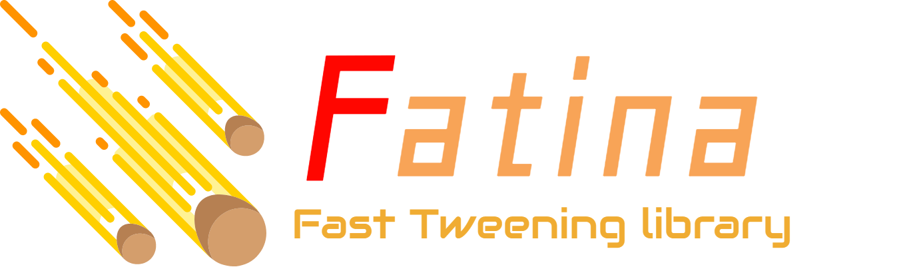

# Fatina
Small & Light tweening library for **Games** / **Web**

* **Website**: [Here](https://kefniark.github.io/Fatina/)
* **API**: [Here](https://kefniark.github.io/Fatina/basics/api/)
* **Samples**: [Here](https://kefniark.github.io/Fatina/samples/generic/)

## Description
A comprehensive and easy to use animation library for **Typescript** / **Javascript**

* Easy to use (API strongly inspired by Dotween)
* Lightweight with no dependencies ( < 25KB )
* Unit tested + code coverage
* Open source and MIT License (use it as you please)

## Getting Started

### Install
If you use directly the minified version
```ts
<script src="fatina.min.js"></script>
```
Or if you use NPM
```ts
> npm install fatina

// and after load it with
var Fatina = require('fatina');
```
* [More Information](https://kefniark.github.io/Fatina/basics/download/)

### Usage
```ts
Fatina.Tween(obj, properties).To(destination, duration).start();
```
* [Documentation](https://kefniark.github.io/Fatina/basics/api/)
* [Samples](https://kefniark.github.io/Fatina/samples/generic/)
